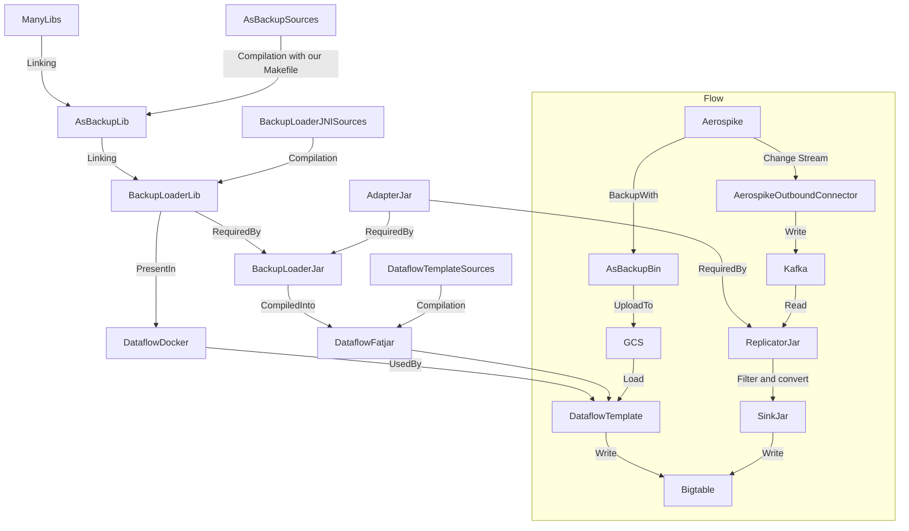

# Aerospike Migration Tools

This project provides tools for migrating data between Aerospike and Cloud
Bigtable. It is organized into three submodules: `adapter` and `backup-loader`.
Additionally, the project includes a development container
(`devcontainer`) for a streamlined development environment and utility scripts
for running and publishing the tools.

______________________________________________________________________

## Submodules

### 1. Adapter

The `adapter` module provides utilities for converting entities between
Aerospike and Cloud Bigtable. It includes:

- **AerospikeRowMutation**: A utility for creating Cloud Bigtable mutations from
  Aerospike records.
- **AerospikeRecord**: A utility for parsing Cloud Bigtable rows into
  Aerospike-like records.

This module is essential for bridging the gap between the two database systems,
enabling seamless data transformation by keeping the encoding consistent between
Cloud Bigtable's ecosystem and other migration tools.

______________________________________________________________________

### 2. Backup Loader

The `backup-loader` module is responsible for loading Aerospike backups into
Cloud Bigtable. It includes:

- **BackupReader**: A JNI-based utility for reading Aerospike backup files.
- **ReadRecordResult**: A Java class representing the result of reading a record from
  an Aerospike backup.
- **Native Code**: C code for parsing Aerospike backup files and interfacing
  with Java via JNI.

The `backup-loader` is designed to process Aerospike backup files and write the
data into Cloud Bigtable using the `adapter`.

______________________________________________________________________

### 3. Replicator

The `replicator` module is a Kafka Connect Single Message Transformation responsible for converting Aerospike
[XDR JSON Kafka messages](https://aerospike.com/docs/connectors/streaming/common/formats/json-serialization-format/)
into messages ingestible by [Kafka Connect Bigtable Sink](https://github.com/GoogleCloudPlatform/cloud-bigtable-ecosystem/tree/main/kafka-connect-bigtable-sink).

It's meant to be used for streaming Aerospike changes into Cloud Bigtable.

______________________________________________________________________

## Development Environment

### Using the Devcontainer

The project includes a `.devcontainer` configuration for setting up a consistent
development environment. The devcontainer provides:

- All necessary dependencies for building and running the project.
- Pre-installed tools like `maven`, `gcc`, and `docker`.
- Configured paths for JNI development.

To use the devcontainer:

1. Open the project in Visual Studio Code.
1. When prompted, reopen the project in the devcontainer.
1. The environment will be set up automatically, including linking the Aerospike
   tools directory.

______________________________________________________________________

## Workflow

[Justfile](./Justfile) is an index of interesting commands and shortcuts to running them.

Note that if you want to execute `mvn` commands directly, you should do so from the top directory.

### 1. Building the Project

To build the project, run:
```bash
just build
```

Or to build just backup reader:
```bash
just run-mvn backup-loader compile
```

### 2. Running the Backup Loader

Follow the steps in "Running the Backup Loader" in the "Utility Scripts" section
to load Aerospike backups into Cloud Bigtable.

______________________________________________________________________

## Utility Scripts

### 1. Running the Backup Loader

```bash
just run-backup-loader
```
important**:** before running it, you should run the Bigtable emulator on host (`just run-emulator`)

______________________________________________________________________

### 2. Publishing to Local Repository

To install `backup-loader` and `adapter` modules to the local Maven repository so they can be added as
dependencies in other locally built projects, run:
```bash
just install
```

______________________________________________________________________

## Notes

Inside the `backup-loader` there is a directory `aerospike` which contains utility files used for development.

### Compilation

[Dockerfile](.devcontainer/Dockerfile) documents how to build both the project and the dependencies.

Inside the docker container from `.devcontainer`, both shared libraries and the CLI tools are already built in `/app/bin/`:
- `asbackup`
- `asbackup.so`
- `asrestore`
- `asrestore.so`

### Generating A Backup

To generate a backup, start an Aerospike server:
```bash
just run-aerospike
```

Next run the seeding script. It will populate the database with some rows.

```bash
pip install aerospike==16.0.1
python seed_aerospike.py
```

Lastly, create the backup using the executable `asbackup` like so:

```bash
asbackup --host 127.0.0.0 --port 3000 --namespace dinosaurs --output-file backup1.asb
```

Notes on how to compile `asbackup` are located in the section about compiling
dependencies.

### Important Considerations:

- aerospike does not store keys by default - only digests. It has to be
  configured to do so. The dockerfile provided here has that option enabled.
  That is why example backups made with this configuration located in the
  aerospike folder contain keys.

# TODO: describe backup-loader's compilation more closely

# Dataflow (TODO: word it better)
## Docker image:
```bash
just build-worker-image TODOURL 2.65.0
docker push TODOURL:2.65.0
```

## Replicator jar
```
cd aerospike-migration-tools
mvn -pl adapter,replicator package
```

## Sink jar
- TODO: see readme at kafka-connect-bigtable-sink

## Dataflow template
Within docker (with dataflow sources mounted at `/dataflow`):

- TODO: also mount local directory under `/dataflow/v2/aerospike-backup-to-bigtable/target`
- TODO: wrap it into a justfile recipe
- TODO: do some kind of ~/.m2 caching - otherwise there'll be problems with slow build

```bash
cd aerospike-migration-tools
just install
cd /dataflow
mvn package -DskipTests -pl v2/aerospike-backup-to-bigtable -am
```

## Dependency tree (TODO: REMOVE)


# Migration from Aerospike to Cloud Bigtable

For a high-level overview of the process, see [Migrate from Aerospike to Bigtable document](TODO), this section documents how to obtain the executables needed for the process.

## Dataflow template `AerospikeBackupToBigtable`

<!-- TODO: link to Google-owned repo -->
[A fork of DataflowTemplates contains `AerospikeBackupToBigtable`](https://github.com/Unoperate/DataflowTemplates/tree/kb/aerospike2/v2/aerospike-backup-to-bigtable), a Dataflow template that can be used to load data from Aerospike backups into Cloud Bigtable.

Note that it uses `backup-reader` module for reading these files, so it uses `adapter` module for mapping Aerospike values into Bigtable ones.

### How to use it

#### Build and push the worker image
In this step we build OCI image used by Dataflow worker nodes to run the actual work on.

CAUTION: Use the tag matching the `beam.version` property of the root pom.xml from the Dataflow repository!
```bash
just build-worker-image $REGISTRY/$IMAGE_NAME-worker $VERSION
docker push $REGISTRY/$IMAGE_NAME-worker:$VERSION
```

#### Build and stage the template
In this step we build and publish (into buckets and registries configured by the arguments):
- fat jar of the Dataflow template
- OCI image of Dataflow template's job manager (which coordinates the worker nodes)
- JSON descriptor of the Dataflow template (it points to the job manager image and contains some metadata such as the template's arguments and their description)

##### Authentication
Note that this action needs to upload data to GCP using Application Default credentials.
It is also to be run in a Docker container (due to `backup-reader`'s dependencies), so you need to ensure that the process in the container is authenticated.

If you're running on GCP, you can just pass `--dns=169.254.169.254` argument to `docker run` command - see the command below to verify that the IP is correct and that Application Default Credentials use the expected service account:
```bash
docker run --dns=169.254.169.254 --rm curlimages/curl curl -sH "Metadata-Flavor: Google" http://169.254.169.254/computeMetadata/v1/instance/service-accounts/default/email
```

If you're running outside of it, follow the [README](https://docs.cloud.google.com/docs/authentication/provide-credentials-adc).

##### Build
Build the container:
```bash
docker build . --target compiled -t aerospike-bigtable-migration-tools
```

Note that the build process of Dataflow pulls a large number of dependencies, so you might want to add flag such as `-v ./.m2:/root/.m2` to avoid redownloading them all if you end up needing to build it more than once.

Also mind the `--dns` flag described in [Authentication](#authentication) section.

Clone the `DataflowTemplates` repo somewhere and start the container with:
```bash
docker run --rm -it -v PATH_TO_DATAFLOW_TEMPLATES_REPO:/dataflow aerospike-migration-tools
```
Then within it run:
```bash
# Install Java packages of `aerospike-bigtable-migration-tools` into local maven repository.
just install
# Now do the operations on the Dataflow template.
cd /dataflow
mvn package -PtemplatesStage -DskipTests -DprojectId="$PROJECT_ID" -DbucketName=$BUCKET_NAME -DstagePrefix="templates" -DtemplateName="AerospikeBackupToBigtable" -DartifactRegistry=$REGISTRY/$IMAGE_NAME -pl v2/aerospike-backup-to-bigtable -am
```

#### Run the template
After executing the steps described, there should be:
- `$REGISTRY/templates/$IMAGE_NAME` - job manager image
- `$REGISTRY/$IMAGE_NAME-worker:$VERSION` - worker image
- `gs://$BUCKET_NAME/templates/flex/Aerospike_Backup_To_Bigtable` - Dataflow template's descriptor

To run it:
- go to https://console.cloud.google.com/dataflow/createjob
- pick `Custom template` as Dataflow template
- paste or pick the path to the Dataflow template descriptor
- fill in the template's parameters
- **[IMPORTANT]** Fill "SDK Container Image" field under "Optional parameters" with `$REGISTRY/$IMAGE_NAME-worker:$VERSION`

Alternatively you can do the same using `gcloud dataflow flex-template run` command or Terraform provider.
In any case, remember to use the worker image!

## Kafka Connect tools

You can set up a Kafka Connect pipeline consisting of:
- [`org.apache.kafka.connect.json.JsonConverter`](https://github.com/apache/kafka/blob/trunk/connect/json/src/main/java/org/apache/kafka/connect/json/JsonConverter.java),
- [`MapAerospikeConnectJsonToBigtableSinkInput`](replicator/src/main/java/com/google/cloud/aerospike/MapAerospikeConnectJsonToBigtableSinkInput.java),
- [`BigtableSinkConnector`](../kafka-connect-bigtable-sink/sink/src/main/java/com/google/cloud/kafka/connect/bigtable/BigtableSinkConnector.java).

It will respectively:
- deserialize [JSON-formatted Aerospike Outbound Connector's messages](https://aerospike.com/docs/connectors/streaming/kafka/outbound/formats/json-serialization-format),
- filter records older than some threshold and map their Aerospike values into Bigtable ones,
- write the mapped Bigtable values into Cloud Bigtable.

### `replicator.jar` containing `MapAerospikeConnectJsonToBigtableSinkInput`
Run:
```bash
mvn clean package -pl adapter,replicator -DskipUnitTests
```
Copy the fat .jar from `replicator/target`.

### `sink.jar` containing `BigtableSinkConnector`
See the README from [../kafka-connect-bigtable-sink/README.md](../kafka-connect-bigtable-sink/README.md).
